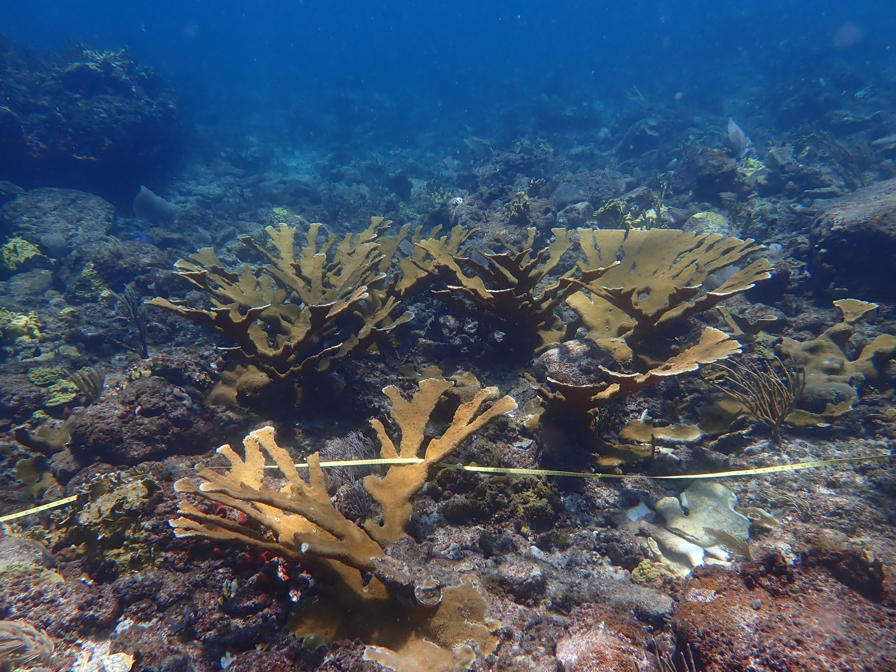

```{r}
#| label: setup-and-process
#| message: false
#| warning: false
#| echo: false

# Source all custom functions for the analysis
source("code/dataFunctions.R")

# Load the raw data from the data directory
library(readxl)
TaggedColonies <- read_xlsx("data/TaggedColonies.xlsx")

# Process and summarize the data by calling the functions
Tagged_Metrics <- wrangle_coral_data(TaggedColonies)
site_summary <- summarize_site_metrics(Tagged_Metrics)
binned_proportions <- calculate_binned_proportions(Tagged_Metrics)
```

::: grid 
:::: g-col-2

<div style="text-align: center;">
## TOC
</div>

<div class="nav flex-column nav-pills align-items-center" id="v-pills-tab" role="tablist" aria-orientation="vertical"> 

### Colony Demographics 

<button class="nav-link active" id="v-pills-col-demo-about-tab" data-bs-toggle="pill" data-bs-target="#v-pills-col-demo-about" type="button" role="tab" aria-controls="v-pills-col-demo-about" aria-selected="true">About</button> 
<button class="nav-link" id="v-pills-lai-tab" data-bs-toggle="pill" data-bs-target="#v-pills-lai" type="button" role="tab" aria-controls="v-pills-lai" aria-selected="false">LAI</button> 
<button class="nav-link" id="v-pills-cover-tab" data-bs-toggle="pill" data-bs-target="#v-pills-cover" type="button" role="tab" aria-controls="v-pills-cover" aria-selected="false">Percent Cover</button> 
<button class="nav-link" id="v-pills-dist-tab" data-bs-toggle="pill" data-bs-target="#v-pills-dist" type="button" role="tab" aria-controls="v-pills-dist" aria-selected="false">Distributions</button> 


### Population Dynamics

<button class="nav-link" id="v-pills-pop-dyn-about-tab" data-bs-toggle="pill" data-bs-target="#v-pills-pop-dyn-about" type="button" role="tab" aria-controls="v-pills-pop-dyn-about" aria-selected="false">About</button> 
<button class="nav-link" id="v-pills-first-tab" data-bs-toggle="pill" data-bs-target="#v-pills-first" type="button" role="tab" aria-controls="v-pills-first" aria-selected="false">First</button> 
<button class="nav-link" id="v-pills-second-tab" data-bs-toggle="pill" data-bs-target="#v-pills-second" type="button" role="tab" aria-controls="v-pills-second" aria-selected="false">Second</button>
<button class="nav-link" id="v-pills-third-tab" data-bs-toggle="pill" data-bs-target="#v-pills-third" type="button" role="tab" aria-controls="v-pills-third" aria-selected="false">Third</button>
</div>
    
::::

:::: g-col-10

<div class="tab-content" id="v-pills-tabContent">

<div class="tab-pane fade show active" id="v-pills-col-demo-about" role="tabpanel" aria-labelledby="v-pills-col-demo-about">

::::: grid
::::: g-col-8 
::::: {.panel-tabset}
### About
Put stuff here for Colony Demographics about section
:::::
:::::
::::: g-col-4
:::::
:::::

</div>

<div class="tab-pane fade" id="v-pills-lai" role="tabpanel" aria-labelledby="v-pills-lai-tab">

::::: grid 
::::: g-col-8 
::::: {.panel-tabset}
### All
```{r}
#| message: false
#| warning: false
#| echo: false
#| out-width: "100%"

plot_metric_over_time(
  summary_data = site_summary,
  y_var = LAI_mean,
  y_se = LAI_se,
  title = "Mean Live Area Index (LAI) Over Time by Site",
  y_lab = "Mean LAI (± SE)"
)
```

### St. Thomas
```{r}
#| message: false
#| warning: false
#| echo: false
#| out-width: "100%"

site_summary %>%
  filter(Island == "St. Thomas") %>%
  plot_metric_over_time(
    summary_data = .,
    y_var = LAI_mean,
    y_se = LAI_se,
    title = "Mean Live Area Index (LAI) Over Time by Site",
    y_lab = "Mean LAI (± SE)"
  )
```

### St. John
```{r}
#| message: false
#| warning: false
#| echo: false
#| out-width: "100%"

site_summary %>%
  filter(Island == "St. John") %>%
  plot_metric_over_time(
    summary_data = .,
    y_var = LAI_mean,
    y_se = LAI_se,
    title = "Mean Live Area Index (LAI) Over Time by Site",
    y_lab = "Mean LAI (± SE)"
  )
```

### St. Croix
```{r}
#| message: false
#| warning: false
#| echo: false
#| out-width: "100%"

site_summary %>%
  filter(Island == "St. Croix") %>%
  plot_metric_over_time(
    summary_data = .,
    y_var = LAI_mean,
    y_se = LAI_se,
    title = "Mean Live Area Index (LAI) Over Time by Site",
    y_lab = "Mean LAI (± SE)"
  )
```

:::::
:::::
::::: g-col-4
**Live Area Index (LAI)**

A 3-dimensional metric that approximates the total live, photosynthetically-active surface area of a coral colony. Unlike 2D "percent cover" which just measures the area a coral occupies on the seafloor, LAI accounts for the complex, branching structure of species like Acropora. It's calculated by combining the colony's structural volume (from length, width, and height) with its live tissue percentage. Tracking LAI provides a much more comprehensive measure of health; a high LAI suggests a large, complex, and healthy colony, while a decreasing LAI can signal tissue loss, disease, or partial mortality, even if the colony's 2D footprint remains the same.


{fig-align="center"}

:::::
:::::

</div>

<div class="tab-pane fade" id="v-pills-cover" role="tabpanel" aria-labelledby="v-pills-cover-tab">

::::: grid
::::: g-col-8 
::::: {.panel-tabset}

### All
```{r}
#| message: false
#| warning: false
#| echo: false
#| out-width: "100%"

plot_metric_over_time(
  summary_data = site_summary,
  y_var = Perc_Live_mean,
  y_se = Perc_Live_se,
  title = "Mean Percent Living Tissue Over Time by Site",
  y_lab = "Mean % Living Tissue (± SE)"
)
```

### St. Thomas
```{r}
#| message: false
#| warning: false
#| echo: false
#| out-width: "100%"

site_summary %>%
  filter(Island == "St. Thomas") %>%
  plot_metric_over_time(
    summary_data = .,
    y_var = Perc_Live_mean,
    y_se = Perc_Live_se,
    title = "Mean Percent Living Tissue Over Time by Site",
    y_lab = "Mean % Living Tissue (± SE)"
  )
```

### St. John
```{r}
#| message: false
#| warning: false
#| echo: false
#| out-width: "100%"

site_summary %>%
  filter(Island == "St. John") %>%
  plot_metric_over_time(
    summary_data = .,
    y_var = Perc_Live_mean,
    y_se = Perc_Live_se,
    title = "Mean Percent Living Tissue Over Time by Site",
    y_lab = "Mean % Living Tissue (± SE)"
  )
```

### St. Croix
```{r}
#| message: false
#| warning: false
#| echo: false
#| out-width: "100%"

site_summary %>%
  filter(Island == "St. Croix") %>%
  plot_metric_over_time(
    summary_data = .,
    y_var = Perc_Live_mean,
    y_se = Perc_Live_se,
    title = "Mean Percent Living Tissue Over Time by Site",
    y_lab = "Mean % Living Tissue (± SE)"
  )
```

:::::
:::::
::::: g-col-4
**Percent Cover**

Percent Cover is a foundational metric that quantifies the proportion of a coral colony's surface area that is covered in living tissue. This 2-dimensional measurement is typically assessed visually by divers, who estimate what percentage of the colony is alive versus what part is dead skeleton. While it is a quick and essential indicator of immediate health, it can be less descriptive than LAI. For example, a colony could be 100% live but very small, while a large, structurally complex colony might be 80% live. By itself, Percent Live provides a snapshot of tissue health, but when combined with 3D metrics, it gives a more complete picture of the colony's overall condition and resilience.

{fig-align="center"}

:::::
:::::

</div>

<div class="tab-pane fade" id="v-pills-dist" role="tabpanel" aria-labelledby="v-pills-dist-tab">

::::: grid
::::: g-col-8
::::: {.panel-tabset}

### All
```{r}
#| message: false
#| warning: false
#| echo: false
#| out-width: "100%"

plot_size_distribution(binned_proportions)
```

### St. Thomas
```{r}
#| message: false
#| warning: false
#| echo: false
#| out-width: "100%"

binned_proportions %>%
  filter(Island == "St. Thomas") %>%
  plot_size_distribution(.)
```

### St. John
```{r}
#| message: false
#| warning: false
#| echo: false
#| out-width: "100%"

binned_proportions %>%
  filter(Island == "St. John") %>%
  plot_size_distribution(.)
```

### St. Croix
```{r}
#| message: false
#| warning: false
#| echo: false
#| out-width: "100%"

binned_proportions %>%
  filter(Island == "St. Croix") %>%
  plot_size_distribution(.)
```

:::::
:::::
::::: g-col-4
**Size Class Distributions**

A powerful demographic view of the coral population, revealing its underlying structure and how it changes over time. This method involves categorizing each coral colony into a specific size "bin" based on its 3D structural volume (Structure = L x W x H). The resulting stacked plot shows the proportion of the population in each class, from "Dead" (Bin_0) and "Small" (Bin_1) up to "Extra Large" (Bin_4). Watching these proportions shift is crucial; for instance, a growing number of "Small" colonies could signal successful recruitment, while a loss of "Large" colonies might indicate high mortality on the most established corals, significantly impacting the reef's overall complexity and resilience.

{fig-align="center"}

:::::
:::::


</div> 

<div class="tab-pane fade" id="v-pills-pop-dyn-about" role="tabpanel" aria-labelledby="v-pills-pop-dyn-about">

::::: grid
::::: g-col-8 
::::: {.panel-tabset}
### About
Put stuff here for Population Dynamics about section
:::::
:::::
::::: g-col-4
:::::
:::::

</div>

<div class="tab-pane fade" id="v-pills-first" role="tabpanel" aria-labelledby="v-pills-first-tab">

::::: grid 
::::: g-col-8 
::::: {.panel-tabset}
### All
```{r}
#| message: false
#| warning: false
#| echo: false
#| out-width: "100%"

ggplot(data = mtcars, aes(x = wt, y = mpg)) +
  geom_point() +
  labs(title = "Dummy ggplot: MPG vs. Weight",
       x = "Weight (1000 lbs)",
       y = "Miles Per Gallon")
```

### St. Thomas
```{r}
#| message: false
#| warning: false
#| echo: false
#| out-width: "100%"

ggplot(data = mtcars, aes(x = wt, y = mpg)) +
  geom_point() +
  labs(title = "Dummy ggplot: MPG vs. Weight",
       x = "Weight (1000 lbs)",
       y = "Miles Per Gallon")
```

### St. John
```{r}
#| message: false
#| warning: false
#| echo: false
#| out-width: "100%"

ggplot(data = mtcars, aes(x = wt, y = mpg)) +
  geom_point() +
  labs(title = "Dummy ggplot: MPG vs. Weight",
       x = "Weight (1000 lbs)",
       y = "Miles Per Gallon")
```

### St. Croix
```{r}
#| message: false
#| warning: false
#| echo: false
#| out-width: "100%"

ggplot(data = mtcars, aes(x = wt, y = mpg)) +
  geom_point() +
  labs(title = "Dummy ggplot: MPG vs. Weight",
       x = "Weight (1000 lbs)",
       y = "Miles Per Gallon")
```

:::::
:::::
::::: g-col-4
**First population dynamic metric**

Some text about the metric

{fig-align="center"}

:::::
:::::

</div>

</div>

::::
:::